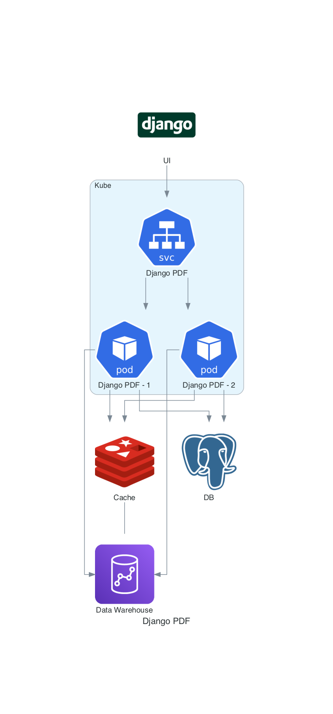

# Django PDF
An app to generate reports from bank statements. A bank statement entry contains the following:
- user id
- Category
- Date
- Description
- Amount

Each category is identified by name and a list of keywords. Each user is identified by id and has an email address and country.

Reports to be generated:
1. Average expenses per country and category.
2. Monthly expenses per country and category.
3. Average recurrent expenses per country.

Some conclusions:
1. Use weasyprint to create PDF from static content (HTML, CSS).
2. Use selenium to create PDF from dynamic content. It handles dynamic Javascript, including React apps, Bootstrap, MUI and ChartsJS. It can also authenticate to external apps. 
3. Use reportlab to create custom PDF from scratch. Probably the most powerful method, but also the most complex one.

Notes:
* Use weasyprint or selenium to generate PDF from existing pages and web apps.
* weasyprint doesn't support Bootstrap or base64 PNG. The carts are created with ChartsJS (dynamic), both also with seaborn plots saved to PNG. None are included in weasyprint report.
* Use weasyprint or selenium if you know HTML, CSS and don't want to learn reportlab.
* You might have to add some custom CSS when generating from HTML (e.g. print media queries).
* Use reporlab to create PDF from scratch using reportlab library (e.g. platypus).
* reportlab is powerful and you can create custom, native-ish looking PDFs.
* reportlab learning curve is high.
* Depending on who's going yo maintain the reports, HTML & CSS is more common than proprietary reportlab.


<details open>
  <summary>Architecture</summary>


</details>

## WeasyPrint vs Selenium vs ReportLab


|                    | WeasyPrint  | Selenium  | ReportLab                      
| ------------------ | ----------  | --------- | ---------
| Static Content (HTML, CSS) | :thumbsup: | :thumbsup: | :thumbsdown:
| Dynamic Content (HTML, CSS, Javascript) | :thumbsdown: | :thumbsup: | :thumbsdown:
| Interactive PDF | :thumbsdown: | :thumbsdown: | :thumbsup:
| Customizations | :thumbsdown: | :thumbsdown: | :thumbsup:
| Links | :thumbsup: | :thumbsup: | :thumbsup:
| Dynamic Charts (ChartsJS) | :thumbsdown: | :thumbsup: | :thumbsdown:
| Tables | :thumbsup: | :thumbsup: | :thumbsup:
| PNG | :thumbsdown: | :thumbsup: | :thumbsup:
| Django Support | :thumbsup: | :thumbsup: | :thumbsup:

## Redshift
We use faker to generate data and store it in S3 as CSV files per user. Then we load data into Redshift and create 
reports. Then we cache reports in redis.

### Create Tables
```
def create_tables(conn: RedshiftConnection):
    with conn:
        conn.execute("""
        create table if not exists transactions(username varchar,
        country varchar,
        category varchar,
        transaction_date varchar,
        description varchar(MAX),
        amount int) 
        """)
```
### Load data from S3
```
def load_data(conn: RedshiftConnection, source: str, iam_role: str):
    LOGGER.info(f'Loading data from {source}')
    with conn:
        conn.execute(f"""
        copy transactions(username, country, transaction_date, description, amount, category) 
        from '{source}' 
        iam_role '{iam_role}' 
        csv;
        """)
```
### Average Expenses per Category
```
    def avg_expenses_per_category(self):
        LOGGER.info('Average expenses per category...')
        result = self.conn.execute("""
        select country, category, abs(median(amount)::int) 
        from (
                select username, country, category, year, month, sum(amount) as amount
                from (
                    select username, country, category, DATE_PART(year, tdate) as year, DATE_PART(month, tdate) as month, amount 
                    from transactions
                ) 
                group by username, country, category, year, month
        )
        group by country, category   
        having country in (select * from countries limit 5)
        order by country     
        """).fetchall()
        return {'columns': ('country', 'category', 'amount'), 'items': result}
```
### Expenses per Month
```
    def expenses_per_month(self):
        LOGGER.info('Expenses per month...')
        result = self.conn.execute("""
        select country, year::int, month::int, abs(median(amount)::int) 
        from (
                select username, country, year, month, sum(amount) as amount
                from (
                    select username, country, DATE_PART(year, tdate) as year, DATE_PART(month, tdate) as month, amount 
                    from transactions
                ) 
                group by username, country, year, month
        )
        group by country, year, month                
        having country in (select * from countries limit 5)
        order by country     
        """).fetchall()
        return {'columns': ('country', 'year', 'month', 'amount'), 'items': result}
```

## Samples
[WeasyPrint](samples/weasyprint.pdf)
[Selenium](samples/selenium.pdf)
[ReportLab](samples/weasyprint.pdf)
